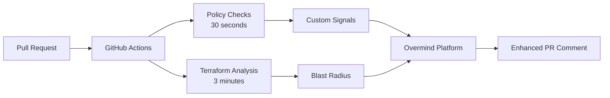

<div align="center">
  <picture>
    <source media="(prefers-color-scheme: dark)" srcset="https://assets-global.website-files.com/6241e92445c21f9c1245a940/6582c2b96d741b023f1afabf_ov-lite-icon-p-500.png">
    
  </picture>

  # Overmind Policy Signals Action

  <p>
    <a href="https://overmind.tech">https://overmind.tech</a>
  </p>
  
  <p>
    Add policy context to your infrastructure changes. Run Conftest/OPA policies and submit violations as organized policy signals to enhance Overmind's risk analysis - all in parallel with your terraform analysis.
  </p>
</div>
<br/>
<p align="center">
  <a href="https://discord.com/invite/5UKsqAkPWG" rel="nofollow"></a>
</p>
<p align="center">
  <a href="https://www.youtube.com/watch?v=cr4Q0oLaANk&t=7s">Watch a demo</a> | <a href="https://docs.overmind.tech/getting-started/overview">Documentation</a> | <a href="https://app.overmind.tech/api/auth/signup">Sign up</a> | <a href="https://www.linkedin.com/company/overmindtech/">Follow us</a>
</p>
<br/>

## Quick Start

Add policy checks to your Overmind workflow in under 2 minutes. This action runs your Conftest/OPA policies and submits violations as organized "Policies" signals, giving you immediate feedback on compliance issues while terraform analysis runs in parallel.

```yaml
- uses: overmindtech/policy-signals-action@v1
  with:
    policies-path: './policies'
    overmind-api-key: ${{ secrets.OVM_API_KEY }}
```

## What This Does

This GitHub Action enhances your Overmind change analysis by:

1. **Running policy checks immediately** when a PR is created/updated
2. **Submitting violations as organized policy signals** to Overmind (in parallel with terraform analysis)
3. **Providing instant feedback** on compliance issues (typically within 30 seconds)
4. **Enriching the PR comment** with policy context alongside blast radius analysis

### How Custom Signals Work

<div align="center">
  
  <p><em>Policy violations appear as organized "Policies" signals in your PR analysis</em></p>
</div>

Overmind aggregates Custom Signals by **title**, not just PR URL and handles the generation of the Signal summary. 

## Installation

### Prerequisites

- An Overmind account ([sign up free](https://app.overmind.tech/api/auth/signup))
- Overmind API key stored as `OVM_API_KEY` in your GitHub secrets
- Terraform repository with policy files (Rego format)
- A GitHub Pull Request (Custom Signals are linked to PRs, not standalone)

### Basic Setup

1. **Add the action to your workflow** (`.github/workflows/terraform.yml`):

```yaml
name: Terraform Analysis with Policies
on:
  pull_request:
    types: [opened, synchronize, reopened]

jobs:
  # Your existing terraform job continues unchanged
  terraform:
    runs-on: ubuntu-latest
    steps:
      - uses: actions/checkout@v4
      - uses: overmindtech/actions/install-cli@main
      - uses: overmindtech/actions/submit-plan@main
        with:
          ovm-api-key: ${{ secrets.OVM_API_KEY }}
          plan-json: ./tfplan.json

  # NEW: Add policy checks in parallel
  policy-checks:
    runs-on: ubuntu-latest
    steps:
      - uses: actions/checkout@v4
      
      - uses: overmindtech/policy-signals-action@v1
        with:
          policies-path: './policies'
          overmind-api-key: ${{ secrets.OVM_API_KEY }}
```

2. **Create your first policy** (`policies/s3-tags.rego`):

```rego
package terraform.s3

deny[msg] {
  resource := input.resource_changes[_]
  resource.type == "aws_s3_bucket"
  not resource.change.after.tags.Owner
  msg := sprintf("S3 bucket %s missing required 'Owner' tag", [resource.address])
}

deny[msg] {
  resource := input.resource_changes[_]
  resource.type == "aws_s3_bucket"
  not resource.change.after.tags.Environment
  msg := sprintf("S3 bucket %s missing required 'Environment' tag", [resource.address])
}
```

3. **Push changes and watch the magic happen!** Policy violations will appear in your PR comment within seconds.

## Configuration

### Action Inputs

| Input | Description | Required | Default |
|-------|-------------|----------|---------|
| `policies-path` | Path to your Conftest/OPA policy files | Yes | - |
| `overmind-api-key` | Your Overmind API key | Yes | - |
| `terraform-plan-json` | Path to terraform plan JSON (if available) | No | Auto-detected |
| `signal-severity` | Default severity for policy violations (-5 to +5) | No | `-3` |
| `signal-category` | Category for organizing policy signals in Overmind | No | `Policies` |
| `ticket-link` | Custom URL to link signals to (e.g., Terraform Cloud run) | No | GitHub PR URL |
| `fail-on-violations` | Fail the action if violations are found | No | `false` |
| `conftest-version` | Version of Conftest to install | No | `0.46.0` |
| `overmind-cli-version` | Version of Overmind CLI to install | No | `1.9.4` |

### Advanced Configuration

```yaml
- uses: overmindtech/policy-signals-action@v1
  with:
    policies-path: './policies'
    overmind-api-key: ${{ secrets.OVM_API_KEY }}
    terraform-plan-json: './tfplan.json'
    signal-severity: -4  # Higher risk score for violations
    signal-category: 'Security Policies'  # Custom category
    ticket-link: 'https://app.terraform.io/app/org/workspace/runs/run-xyz'  # Terraform Cloud run
    fail-on-violations: true  # Block PR on policy violations
```

### Terraform Cloud Integration

The `ticket-link` input is particularly useful for Terraform Cloud workflows:

```yaml
- uses: overmindtech/policy-signals-action@v1
  with:
    policies-path: './policies'
    overmind-api-key: ${{ secrets.OVM_API_KEY }}
    ticket-link: ${{ env.TF_CLOUD_RUN_URL }}  # Links signals to TFC run instead of GitHub PR
```

## Example Policies

### Security Group Rules

```rego
package terraform.security

deny[msg] {
  resource := input.resource_changes[_]
  resource.type == "aws_security_group_rule"
  resource.change.after.cidr_blocks[_] == "0.0.0.0/0"
  resource.change.after.from_port == 22
  msg := sprintf("Security group %s allows SSH from anywhere", [resource.address])
}
```

### Cost Control

```rego
package terraform.cost

allowed_instance_types := [
  "t3.micro", "t3.small", "t3.medium"
]

deny[msg] {
  resource := input.resource_changes[_]
  resource.type == "aws_instance"
  not resource.change.after.instance_type in allowed_instance_types
  msg := sprintf("Instance %s uses non-approved type: %s", 
    [resource.address, resource.change.after.instance_type])
}
```

### Compliance

```rego
package terraform.compliance

deny[msg] {
  resource := input.resource_changes[_]
  resource.type == "aws_db_instance"
  not resource.change.after.storage_encrypted
  msg := sprintf("RDS instance %s has unencrypted storage", [resource.address])
}
```

## How It Works



1. **PR triggers workflow** - Both terraform analysis and policy checks start
2. **Policies run immediately** - Conftest evaluates your terraform plan
3. **Violations become signals** - Each violation is submitted as a Custom Signal linked to the PR URL
4. **Overmind aggregates** - All signals for that PR are collected together
5. **Progressive updates** - PR comment updates as signals arrive
6. **Complete context** - Final comment includes both policy and blast radius info

**Note**: Custom Signals are always linked to a Pull Request URL. This allows Overmind to aggregate all signals (policy violations, terraform risks, etc.) in one place.

## Contributing

We welcome contributions! Please see our [Contributing Guide](CONTRIBUTING.md) for details.

## Testing

We provide two testing approaches for different stages of development:

### 1. Local Policy Testing (No API Required)
Test your policies work correctly without submitting to Overmind:

```bash
# Test policies catch violations in your terraform plan
./test/test-policies.sh ./policies ./tfplan.json

# This will show you what violations would be caught
# but won't submit anything to Overmind
```

### 2. Integration Testing (Real PR Required)
To test the complete flow with actual signal submission:

```bash
# Set your environment variables
export OVERMIND_API_KEY="your_actual_api_key"
export TICKET_LINK="https://github.com/org/repo/pull/123"

# Run the real submission test
./test/test_real_submission.sh
```

**Important**: Custom Signals are always linked to a PR URL. You cannot test signal submission without a real, existing GitHub Pull Request.

### Development

```bash
# Clone the repository
git clone https://github.com/overmindtech/policy-signals-action
cd policy-signals-action

# Run tests
npm test

# Test locally with act
act -j policy-checks --secret-file .env
```

## License

This project is licensed under the MIT License - see the [LICENSE](LICENSE) file for details.

## Support

- [Join our Discord](https://discord.com/invite/5UKsqAkPWG)
- [Read the docs](https://docs.overmind.tech)
- [Report an issue](https://github.com/overmindtech/policy-signals-action/issues)
- [Request a feature](https://github.com/overmindtech/policy-signals-action/issues)

## FAQ

### How do Custom Signals work without a Change ID?
Custom Signals are linked to Pull Request URLs, not specific Change IDs. When you submit a signal with a PR URL, Overmind automatically associates it with any changes for that PR, or holds it until a change is created.

### Can I test this without a real PR?
You can test that your policies detect violations locally using Conftest, but to test the full signal submission flow, you need a real GitHub PR. Custom Signals must be linked to an actual PR URL.

### What happens if I submit signals before running terraform plan?
That's the beauty of parallel execution! Signals are aggregated by PR URL, so they'll appear as soon as they're submitted. The PR comment will progressively update as both policy signals and terraform analysis complete.

### Do signals from different jobs get combined?
Yes! All signals submitted with the same PR URL are automatically aggregated by Overmind, whether they come from policy checks, terraform analysis, or any other source.

### What happens when all policies pass?
**No Custom Signals are submitted!** This is the ideal behavior:

- ✅ **Clean runs are silent** - You only hear from the policy system when there are issues
- ✅ **No noise in PRs** - Policy signals only appear when violations need attention  
- ✅ **Better performance** - No unnecessary API calls when everything is compliant
- ✅ **Clean Overmind dashboard** - Only actual issues create signals

The action logs will show `✓ No policy violations found` and complete successfully. Your PR will only show the standard terraform analysis without any policy-related Custom Signals.

---

## Legal & Compliance

### Privacy Policy

This action does not collect, store, or process any personal data. The only data transmitted is policy violation information to your configured Overmind instance. For more information, see [Overmind's Privacy Policy](https://overmind.tech/info/privacy-policy).

### Terms of Service

By using this action, you agree to the [GitHub Terms of Service](https://docs.github.com/en/site-policy/github-terms/github-terms-of-service) and [Overmind's Terms of Service](https://overmind.tech/info/terms-of-use).

### Contact

- **Support**: Join our [Discord community](https://discord.com/invite/5UKsqAkPWG)
- **Security Issues**: Email <security@overmind.tech>
- **General Inquiries**: Contact us at <hello@overmind.tech>

---

*Made with care by [Overmind](https://overmind.tech)*
